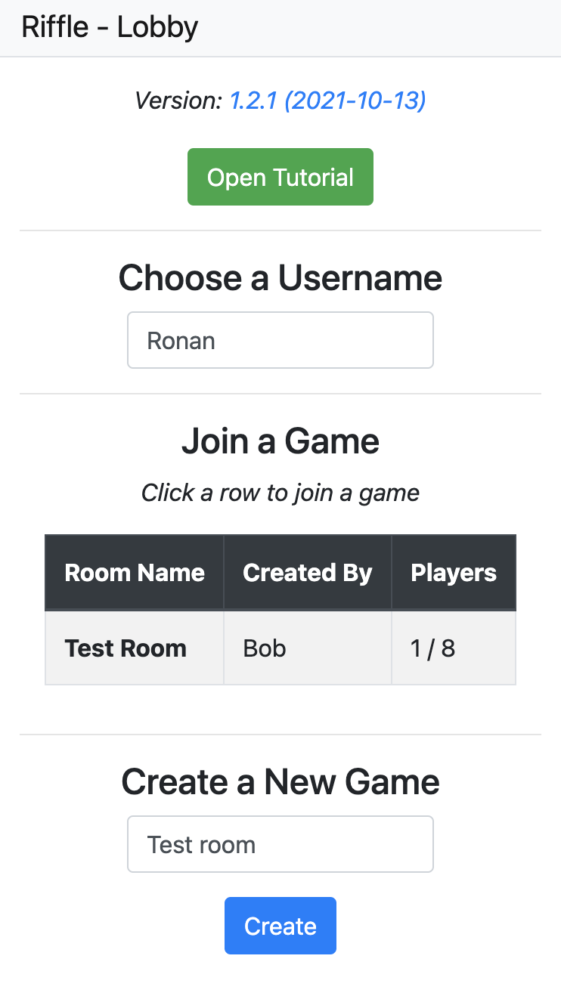
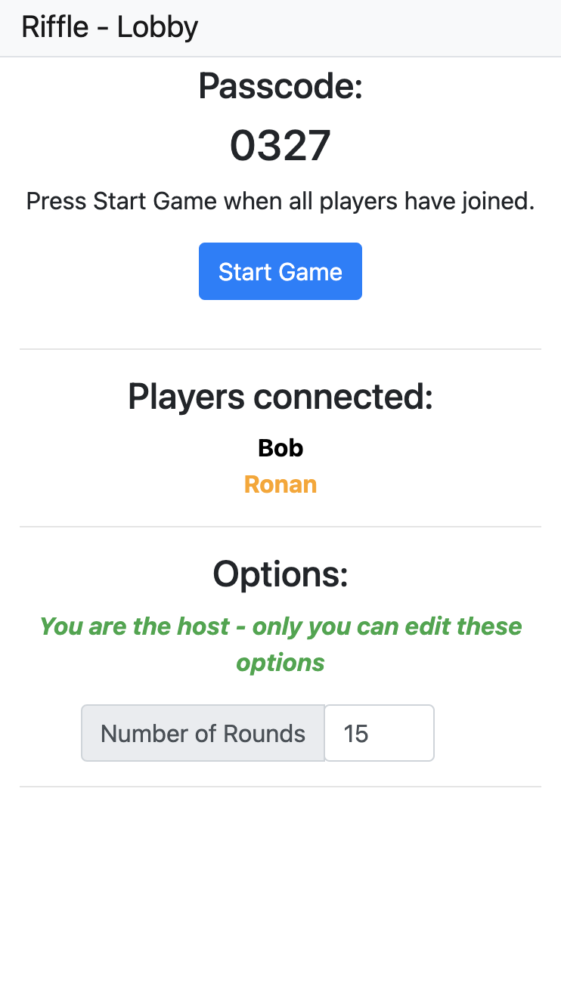
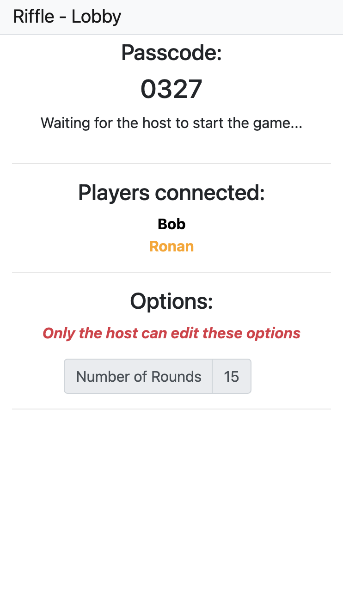
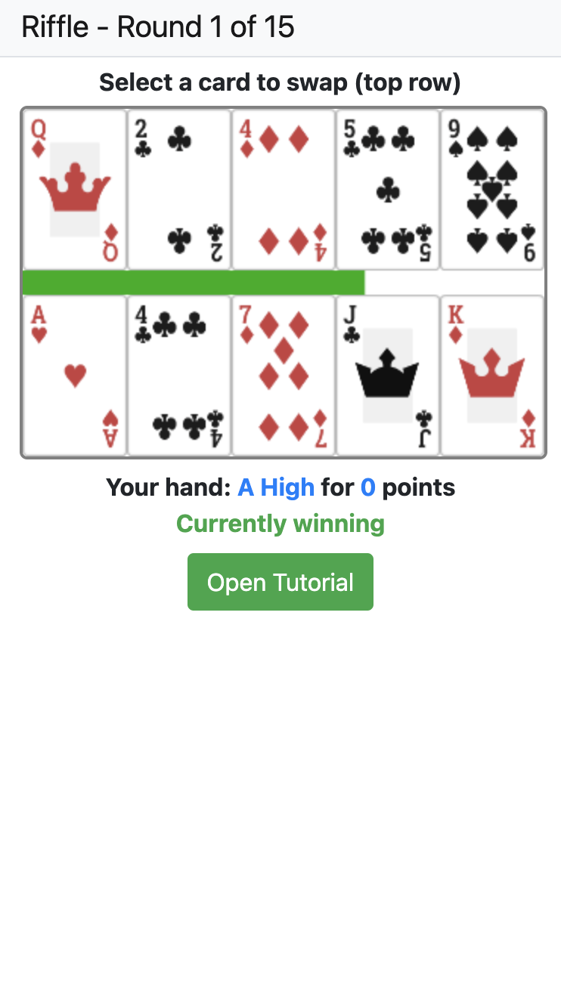
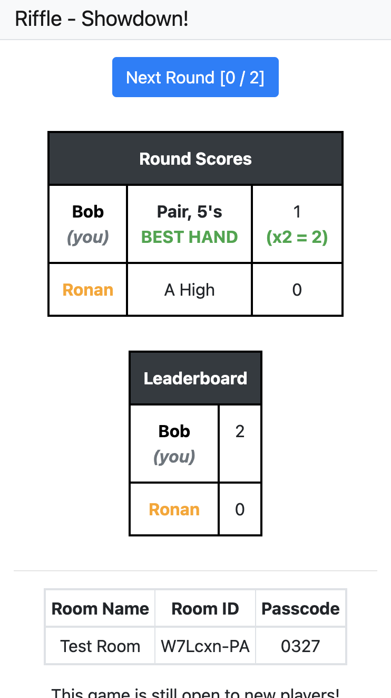
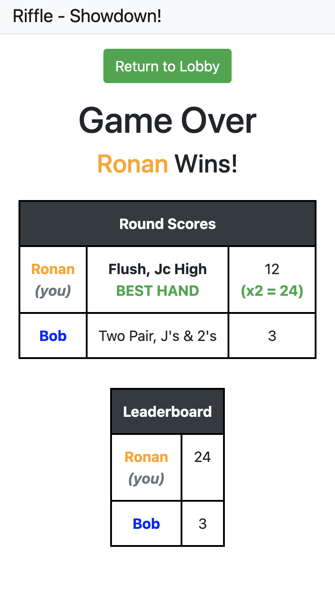
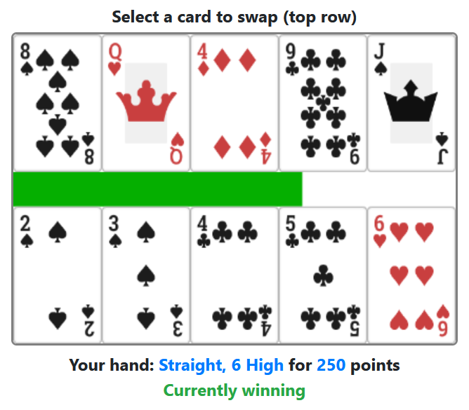
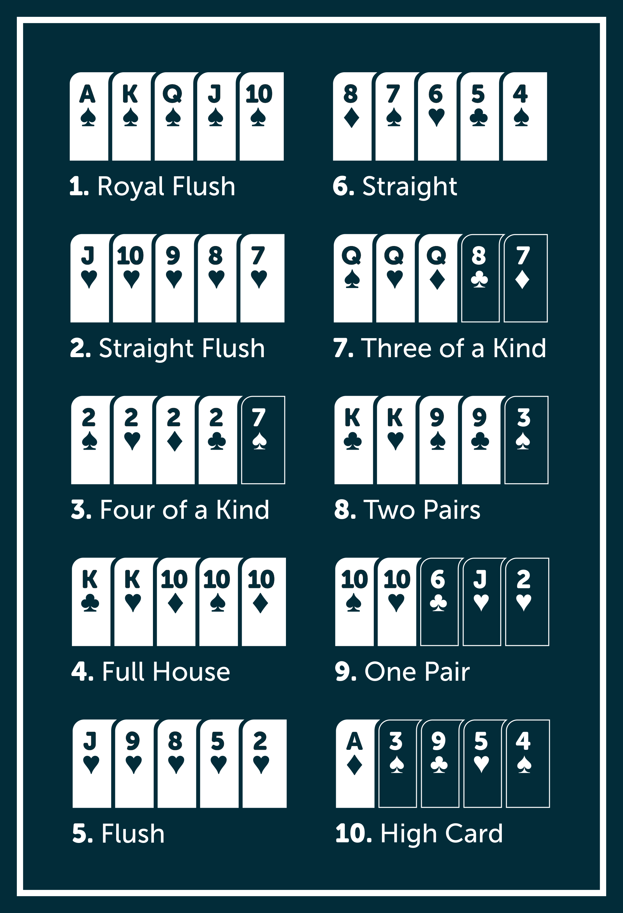

# Riffle

Riffle is a poker based speed card game. I built it using Angular for the front end, and a websocket based node framework for the backend called Colyseus.

The game can be hosted locally by running `npm start` in both the server and client directories, after installing node and running `npm ci`.

## Contributing

I keep track of feature development and bugs with Github Issues. If anyone wanted to contribute, they could tackle an issue there or create a new issue. PRs are welcome too!

## Screenshots

### Home Screen
<kbd></kbd>

### Lobby (As Host)
<kbd></kbd>

### Lobby (As Guest)
<kbd></kbd>

### Playing
<kbd></kbd>

### Round End
<kbd></kbd>

### Game Over

<kbd></kbd>

## Tutorial (available in-game)

    <ul>
    <li>
        The game is split up into rounds.
    </li>
    <li>
        The goal of each round is to make the best poker hand you can each round.
    </li>
    </ul>
    

    <h3>Example round:</h3>
    
    

    <ul>
    <ul>
        <li>
        The top row: these are the shared cards between players, "on the table".
        </li>
        <li>
        The bottom row: these are the cards in your own hand. Only you can see these cards.
        </li>
        <li>
        The green bar: this shows the remaining time in the round.
        </li>
        <li>
        "Currently winning": indicates that you currently have the best hand in round out of all players.
        </li>
    </ul>
    <li>
        To swap a card from the table to your hand, first select the card you want from the top row. Then select a card in your hand to swap.
    </li>
    <li>
        Each round, you will earn points corresponding to the hand you've made.
        <ul>
        <li>
            You will score a large bonus if you have the best hand at the end of the round.
        </li>
        </ul>
    </li>
    <li>
        A showdown concludes each round, showing the result of the round, and the overall scoes of the game.
    </li>
    </ul>
    <h3>Hands:</h3>
    

